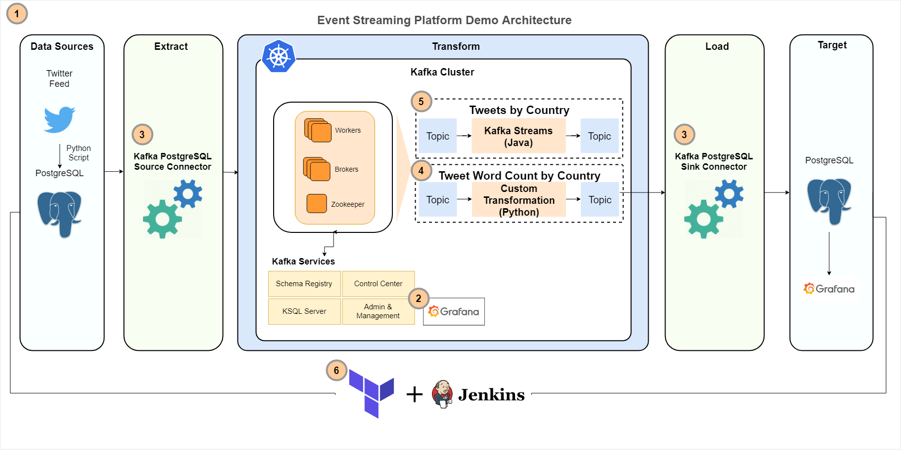

# Kafka Platform demonstration



## Prerequisites

- Docker with Kubernetes (standard on Mac and Windows)
- helm
- terraform
- jq (for parsing kubectl responses)
- git (for getting Confluent helm charts)

## Installation

### Prep

1. Get your local Kubernetes up and running
2. Test it with `kubectl cluster-info`
3. `terraform init terraform`
4. `make kube.proxy` and keep it running on the side

### Provisioning

1. `make provision`

### Destroying

1. `make tf.destroy`

### Kube dashboard

1. Install the dashboar (it's purposefully not part of the solution): `helm install stable/kubernetes-dashboard --name kube-dashboard`
2. `make dashboard.open`. This will open the web app and put the token in your clipboard
3. Use the token from your clipboard

## Accessing services

### Control Center UI

1. `make control-center.open`

### Grafana

1. `make grafana.open`. User: admin, password is in your clipboard.

### Twitter forwarder

The Twitter forwarder is started by default, but you can also stop it.

1. `make twitter-forwarder.start` to start feeding Twitter messages to the database
2. `make twitter-forwarder.stop` to... stop

### Jenkins

1. Wait a few minutes for the service to come up
2. `make jenkins.open`
3. `make jenkins.password`
4. Log in with user admin and password from the output above

### Console consumer for Twitter feed

1. `make consumer.twitter`  
  
---
  
### AWS Deployment

AWS Deployment is split into two sections, AWS cluster deployment module (eks) and resource deployment module (app). Local deployment (above) assumes local cluster has been provisioned and is available and only deploys the app terraform module. AWS Deployment will deploy both cluster and app modules to AWS.

1. Setup AWS config and `terraform init terraform`. Credentials and set local environment variable AWS_DEFAULT_REGION to your region for terraform. 

2. Build the Docker images ([kafka-streams](kafka-streams/), [tweets-transformation](tweets-transformation/), and [twitter-forwarder](twitter-forwarder/)) then deploy to AWS ECR. [(see AWS ECR Documentation for reference)](https://docs.aws.amazon.com/AmazonECR/latest/userguide/docker-basics.html). When you run the next step terraform will point to your AWS ECR images under the `latest` tag.

4. Run `make provision.aws` and start the proxy in a separate terminal (`make kube.proxy`)  
    It will take 10-15 minutes for the EKS cluster to provision in AWS, and an additional 10-20 minutes for the services to deploy and come up.

    The `make provision.aws` command will do the following:  
      * `tf.apply.eks` (EKS TF module)
      * `configure.aws.kubeconfig` (Configures kubectl on your system for EKS endpoint)
      * `configure.helm.svcaccount` (Configures helm service account in EKS)
      * `tf.apply.local` (Deploys kafka-demo to the EKS cluster)
      * `connectors.add.both` (Configures connectors)
      * `twitter-forwarder.start.aws` (Starts the twitter forwarder service in EKS)


Run `make tf.destroy` to remove both the kafka-demo resources and EKS cluster.

#### Revert to local deployment

Update kubectl to point to your local Kubernetes cluster by running:  
  `kubectl config use-context docker-desktop` (if using docker-desktop)

Follow instructions at top of the Readme (`make provision` or `make provision.app`)

`make provision` (or `make provision.app`) will deploy only the local application resources in the `kube` module, and skip the AWS resources `eks` module. The deployment will use your local Docker images for `kafka-streams`, `tweets-transformation`, and `twitter-forwarder`.

#### Terraform v0.11 / v0.12

For use with Terraform v0.11 use the source `github.com/terraform-aws-modules/terraform-aws-eks?ref=v4.0.2` in `terraform/eks/eks.tf` eks module. For use with Terraform v0.12 use `terraform-aws-modules/eks/aws`. 

#### Services  

* Control Center  
  Control center comes up by running :  
  `make control-center.open`  

* Grafana  
  Grafana comes up by running :  
   `make grafana.open.aws`

* Dashboard  
  Dashboard does not seem to start correctly. The container fails to start in the default namespace, with errors in the logs. Likely permissions
    ```
    panic: secrets is forbidden: User "system:serviceaccount:default:kube-dashboard-kubernetes-dashboard" cannot create resource "secrets" in API group "" in the namespace "kube-system"
    ```

    Full Logs:
    ```
    2019/09/03 20:45:04 Starting overwatch
    2019/09/03 20:45:04 Using in-cluster config to connect to apiserver
    2019/09/03 20:45:04 Using service account token for csrf signing
    2019/09/03 20:45:04 Successful initial request to the apiserver, version: v1.13.10-eks-5ac0f1
    2019/09/03 20:45:04 Generating JWE encryption key
    2019/09/03 20:45:04 New synchronizer has been registered: kubernetes-dashboard-key-holder-kube-system. Starting
    2019/09/03 20:45:04 Starting secret synchronizer for kubernetes-dashboard-key-holder in namespace kube-system
    2019/09/03 20:45:04 Synchronizer kubernetes-dashboard-key-holder-kube-system exited with error: unexpected object: &Secret{ObjectMeta:k8s_io_apimachinery_pkg_apis_meta_v1.ObjectMeta{Name:,GenerateName:,Namespace:,SelfLink:,UID:,ResourceVersion:,Generation:0,CreationTimestamp:0001-01-01 00:00:00 +0000 UTC,DeletionTimestamp:<nil>,DeletionGracePeriodSeconds:nil,Labels:map[string]string{},Annotations:map[string]string{},OwnerReferences:[],Finalizers:[],ClusterName:,Initializers:nil,},Data:map[string][]byte{},Type:,StringData:map[string]string{},}
    2019/09/03 20:45:06 Restarting synchronizer: kubernetes-dashboard-key-holder-kube-system.
    2019/09/03 20:45:06 Starting secret synchronizer for kubernetes-dashboard-key-holder in namespace kube-system
    2019/09/03 20:45:06 Synchronizer kubernetes-dashboard-key-holder-kube-system exited with error: kubernetes-dashboard-key-holder-kube-system watch ended with timeout
    2019/09/03 20:45:08 Restarting synchronizer: kubernetes-dashboard-key-holder-kube-system.
    2019/09/03 20:45:08 Starting secret synchronizer for kubernetes-dashboard-key-holder in namespace kube-system
    2019/09/03 20:45:08 Synchronizer kubernetes-dashboard-key-holder-kube-system exited with error: kubernetes-dashboard-key-holder-kube-system watch ended with timeout
    2019/09/03 20:45:10 Storing encryption key in a secret
    panic: secrets is forbidden: User "system:serviceaccount:default:kube-dashboard-kubernetes-dashboard" cannot create resource "secrets" in API group "" in the namespace "kube-system"

    goroutine 1 [running]:
    github.com/kubernetes/dashboard/src/app/backend/auth/jwe.(*rsaKeyHolder).init(0xc4203b0a80)
            /home/travis/build/kubernetes/dashboard/.tmp/backend/src/github.com/kubernetes/dashboard/src/app/backend/auth/jwe/keyholder.go:131 +0x35e
    github.com/kubernetes/dashboard/src/app/backend/auth/jwe.NewRSAKeyHolder(0x1367500, 0xc420269da0, 0xc420269da0, 0x1213a6e)
            /home/travis/build/kubernetes/dashboard/.tmp/backend/src/github.com/kubernetes/dashboard/src/app/backend/auth/jwe/keyholder.go:170 +0x64
    main.initAuthManager(0x13663e0, 0xc420122240, 0xc4204cfcd8, 0x1)
            /home/travis/build/kubernetes/dashboard/.tmp/backend/src/github.com/kubernetes/dashboard/src/app/backend/dashboard.go:185 +0x12c
    main.main()
            /home/travis/build/kubernetes/dashboard/.tmp/backend/src/github.com/kubernetes/dashboard/src/app/backend/dashboard.go:103 +0x26b
    ```


